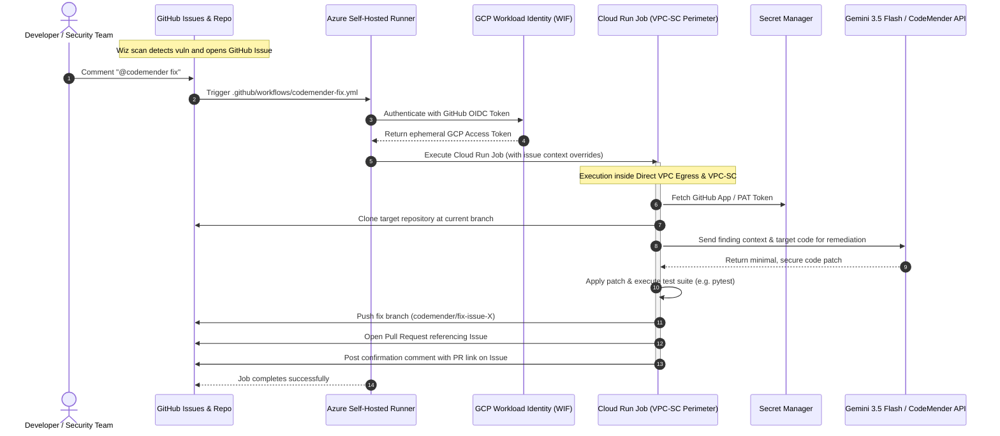

# Architecture & Security Design: CodeMender CI/CD Integration

This document outlines the architectural and security design for integrating Google CodeMender into a CI/CD workflow triggered by Wiz security findings.

---

## 1. High-Level Architecture

---

## 2. Security Boundaries & Guardrails

### A. Authentication via Workload Identity Federation (WIF)
* **Zero Long-Lived Keys**: Azure-hosted runners authenticate to Google Cloud using short-lived GitHub Actions OIDC tokens via a dedicated Workload Identity Pool and Provider.
* **Strict Subject Constraints**: The WIF provider validates that the token was issued for the designated GitHub organization (`assertion.repository_owner == var.github_owner`).

### B. Inbound Access & Invocation
* **Internal Ingress**: Cloud Run compute resources are restricted from public ingress.
* **Flexible Invocation**:
  * **Option 1 (Default)**: Direct invocation via the Google Cloud Run API (`run.googleapis.com`) using IAM permissions granted via WIF.
  * **Option 2 (Private Interconnect)**: Private HTTP invocation via an Internal Application Load Balancer (ILB) with Serverless NEG over an existing Azure-to-GCP VPN or Interconnect.

### C. Outbound Access & Direct VPC Egress
* **Direct VPC Egress**: Configured with `egress = "ALL_TRAFFIC"` to route all outbound network traffic from the container through a private VPC subnet.
* **Controlled Internet Egress**: Outbound connections to GitHub API (`github.com`) and package registries are routed through a dedicated Cloud NAT gateway (which can be toggled off if an enterprise egress proxy is used).

### D. VPC Service Controls (VPC-SC)
* **Data Exfiltration Prevention**: Encloses the project, Cloud Run jobs, Artifact Registry, Secret Manager, and Vertex AI services within a secure Service Perimeter.
* **Access Policies**: Restricts API calls to authorized service accounts and VPC networks only.

### E. Credential Isolation
* GitHub credentials (PAT or GitHub App private keys) are stored in Secret Manager and accessed only at runtime by the Cloud Run execution service account.
