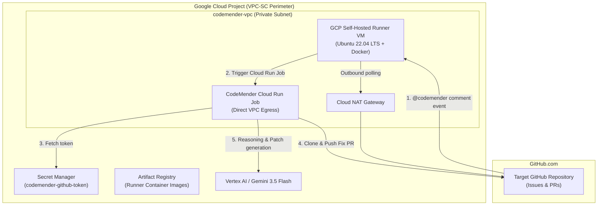

# Self-Hosting GitHub Actions Runners in Google Cloud Platform (GCP)

This guide provides instructions and architectural details for provisioning and running self-hosted GitHub Actions runners natively within Google Cloud.

---

## 1. Architecture Overview

When self-hosting GitHub runners in GCP:
* **Private Network Residency**: The runner VM runs on Compute Engine inside the `codemender-vpc` subnet (`codemender-runner-subnet`), sharing the same network perimeter as the CodeMender Cloud Run Jobs.
* **No External Public IP**: The runner VM has no external public IP address. Outbound traffic (to `github.com` and package repositories) flows securely through the Cloud NAT gateway.
* **Dual Authentication Modes**:
  1. **Workload Identity Federation (WIF)**: Standard GitHub Actions OIDC authentication without long-lived keys.
  2. **Native Service Account**: The VM can directly assume the `gh-runner-invoker` GCP Service Account via the Compute Engine metadata server, eliminating OIDC token exchange steps if preferred.
* **VPC Service Controls (VPC-SC)**: Since the VM is hosted within the GCP project, it can reside completely within the secure VPC-SC perimeter.



---

## 2. Prerequisites: Obtain GitHub Runner Registration Token

To register the GCP runner instance with your GitHub repository (or organization):

1. In your GitHub repository, navigate to:
   👉 **Settings** $\rightarrow$ **Actions** $\rightarrow$ **Runners** $\rightarrow$ Click **New runner** $\rightarrow$ Choose **New self-hosted runner**.
2. Select **Linux** and **x64**.
3. Under **Configure**, copy the registration token string from the `./config.sh --token <REGISTRATION_TOKEN>` command.
   *(Note: Registration tokens are valid for 1 hour; once registered, the runner maintains persistent credentials).*

---

## 3. Provisioning the Runner VM via Terraform

1. Open `terraform/terraform.tfvars`:
   ```hcl
   # Enable the GCP Runner VM
   enable_gcp_runner                = true
   runner_vm_machine_type           = "e2-standard-2"
   runner_vm_zone                   = "us-central1-a"
   runner_vm_disk_size_gb           = 50
   
   # GitHub Registration Configuration
   github_repo_url                  = "https://github.com/brentmc79/cm-wiz-fix"
   github_runner_registration_token = "YOUR_GITHUB_RUNNER_REGISTRATION_TOKEN"
   github_runner_labels             = "self-hosted,linux,x64,gcp-runner"
   ```

2. Apply the Terraform plan:
   ```bash
   cd terraform
   terraform plan -out=tfplan
   terraform apply tfplan
   ```

3. Verification:
   * Check Terraform outputs for the VM name and internal IP:
     ```bash
     terraform output gcp_runner_instance_name
     terraform output gcp_runner_private_ip
     ```
   * In GitHub under **Settings > Actions > Runners**, the runner will appear with an **Idle (Green)** status labeled `self-hosted`, `linux`, `x64`, and `gcp-runner`.

---

## 4. Monitoring and Operations

### Connect to the Runner VM
You can connect securely using Google Cloud IAP (Identity-Aware Proxy) with no public IP:

```bash
gcloud compute ssh gcp-github-runner-prod \
  --zone="us-central1-a" \
  --project="att-wiz-cm-ci-cd" \
  --tunnel-through-iap
```

### Inspect Runner Service Logs
On the VM, check the startup and runner systemd logs:

```bash
# View the initial startup and registration logs
sudo cat /var/log/github-runner-init.log

# Check the GitHub Actions service status
sudo systemctl status actions.runner.*

# View live runner execution logs
sudo journalctl -u actions.runner.* -f
```

---

## 5. Security Best Practices

1. **No Inbound Attack Surface**: The VM does not have a public IP address and requires no open inbound firewall ports.
2. **Ephemeral Disk Scrubbing**: Docker containers run non-root builds; all build and test caches are purged after execution.
3. **Least Privilege IAM**: The VM runs with `gh-runner-invoker@att-wiz-cm-ci-cd.iam.gserviceaccount.com`, allowing it only to trigger Cloud Run jobs and read logs.
